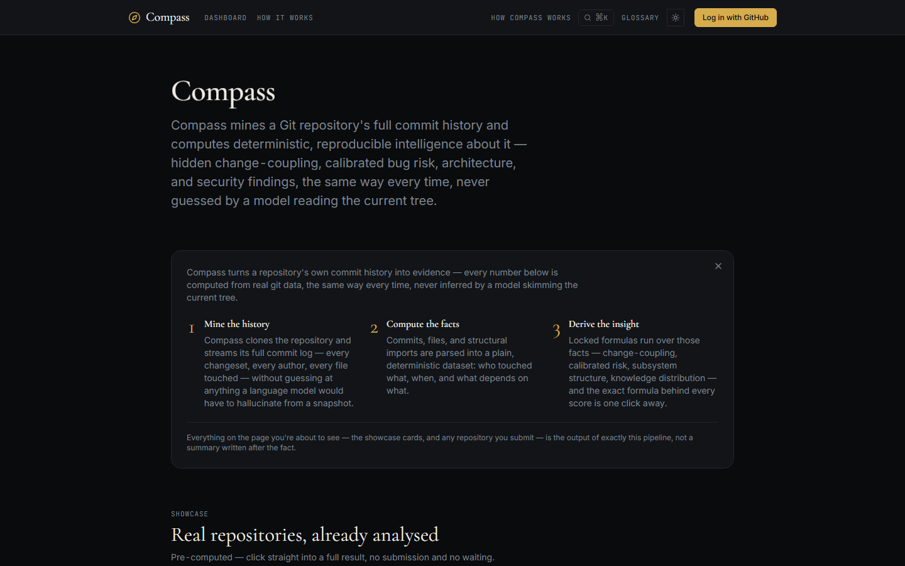
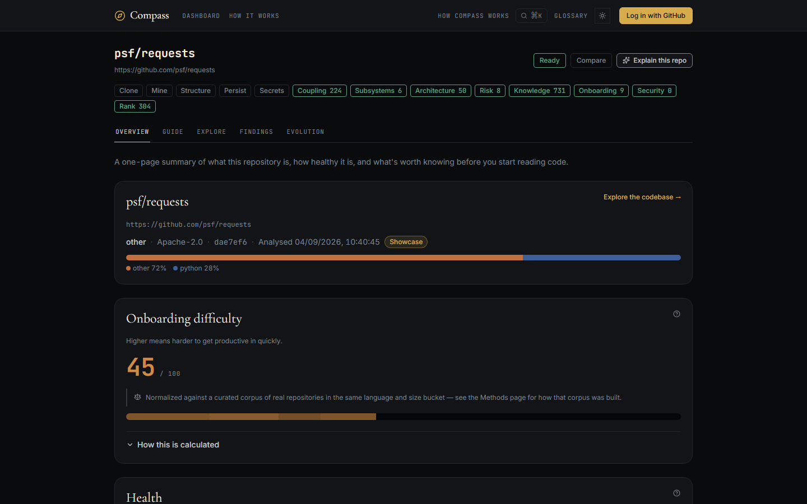
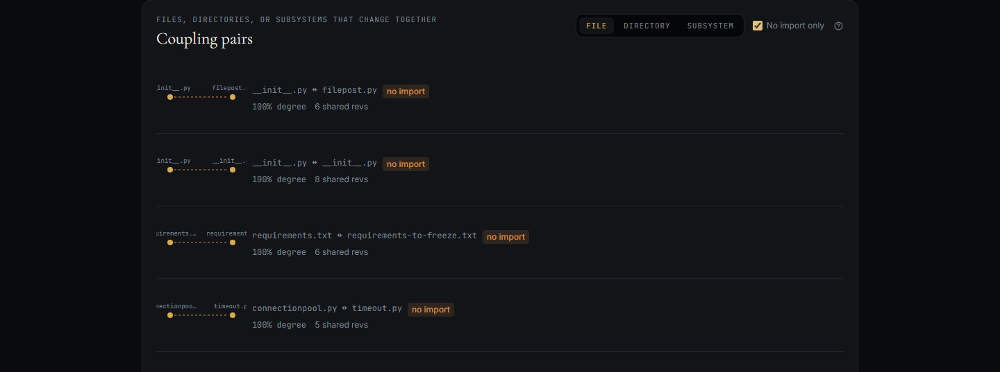
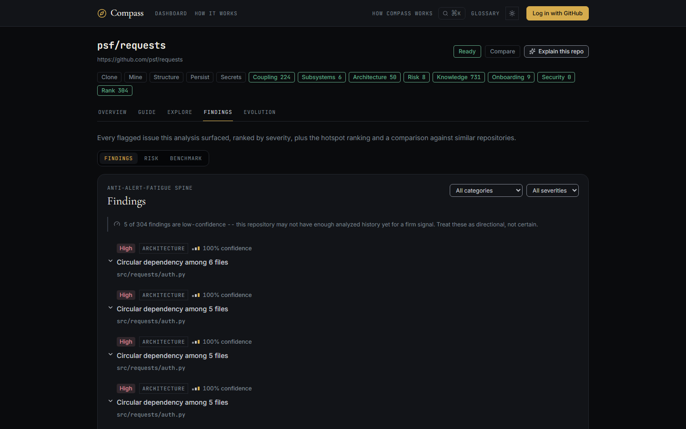
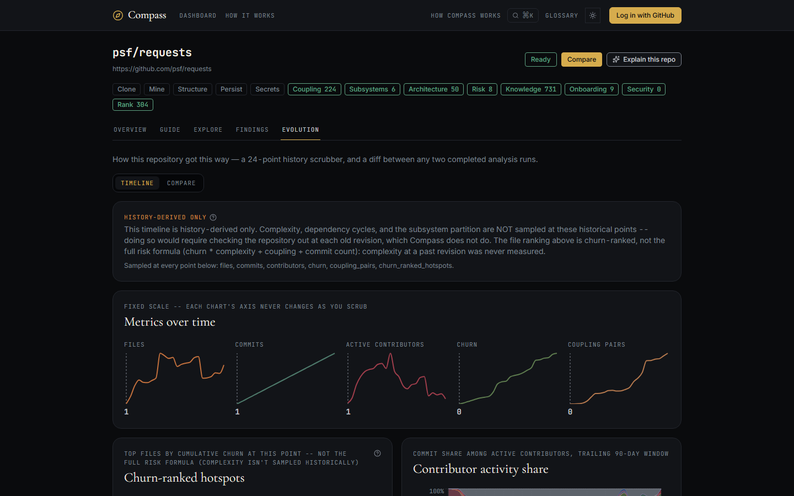
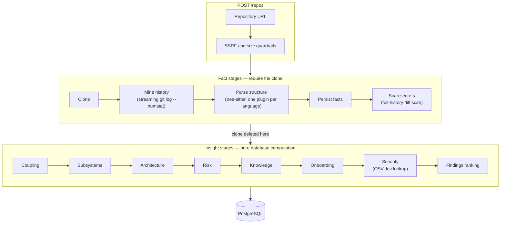
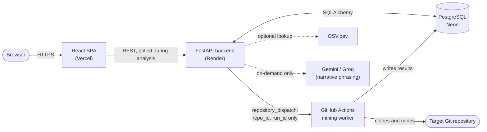

# Compass

**Compass mines a Git repository's full commit history and computes deterministic, reproducible intelligence about it: hidden change-coupling, calibrated risk, architectural structure, and security findings.** It is a measurement tool, not a code assistant — every number it reports is computed from real commit data with a fixed formula, not generated or inferred by a language model.


**Live demo:** [compass-seven-flame.vercel.app](https://compass-seven-flame.vercel.app/) — four repositories are pre-analysed and load instantly; submitting a new one runs on a free-tier host, so it may take a few minutes and the API can take up to a minute to wake from a cold start on the first request.



---

## Table of contents

1. [Overview](#overview)
2. [Motivation](#motivation)
3. [Features](#features)
4. [Screenshots](#screenshots)
5. [System architecture](#system-architecture)
6. [Core algorithms](#core-algorithms)
7. [Calibration and benchmarking](#calibration-and-benchmarking)
8. [Tech stack](#tech-stack)
9. [Repository structure](#repository-structure)
10. [Getting started](#getting-started)
11. [Limitations](#limitations)
12. [Author](#author)

---

## Overview

Most tools that "explain" a codebase — including AI coding assistants — read the current state of the files on disk. That view is missing an entire dimension of information: the *history* of how the code was written, which is where questions like "which files secretly depend on each other," "who actually understands this file," and "where did this vulnerability come from" are actually answered.

Compass clones a repository, streams its full commit log, and runs a fixed pipeline of graph and statistical algorithms over the result. It surfaces:

- **Hidden dependencies** — pairs of files that change together in commit history with no import connecting them.
- **Calibrated risk** — a hotspot score combining churn, complexity, coupling, and change frequency, benchmarked against a curated corpus of real repositories.
- **Architecture** — dependency cycles, layering violations, and a computed subsystem partition (community detection, not folder names).
- **Knowledge distribution** — who has effective ownership of each file (Degree-of-Authorship, a published formula) and the project's truck factor.
- **Security findings** — credentials committed and later deleted from the working tree but still present in history, and known vulnerabilities in declared dependencies.

Every score is deterministic: the same repository at the same commit produces the same output every time.

## Motivation

An AI assistant reading a repository's current file tree is genuinely useful for explaining what a function does or suggesting a refactor. It is structurally unable to do a few specific things, because the information simply is not present in a single snapshot of the code:

1. **History is not in the tree.** Which files are coupled by how they're edited together, where defects have historically clustered, and what secrets were committed and later removed are all facts about *changes over time*, not about the current files.
2. **A snapshot has no notion of confidence or determinism.** Asking a language model to score the same file's risk twice can produce two different answers. A score used to prioritize real engineering work needs to be reproducible.
3. **A snapshot has no comparison population.** Saying a repository's coupling density is unusually high requires a distribution of *other* repositories to compare against, not just the one file tree in front of you.

Compass exists to compute the specific set of facts that require history and a fixed formula, and to say so plainly where a claim is a measured fact versus a documented heuristic. It does not attempt to compete with AI assistants on code explanation, and it optionally uses an LLM for exactly one thing — rephrasing already-computed numbers into a sentence, on request, never as a source of the numbers themselves (see [Core algorithms](#core-algorithms)).

## Features

### Getting oriented in an unfamiliar codebase

| Feature | What it answers |
|---|---|
| Guided reading order | Where should a new contributor start reading? |
| Subsystem map | What are the actual architectural boundaries (computed via Louvain clustering over the coupling + dependency graph)? |
| Expertise / who-to-ask | Who has effective ownership of a given file? |
| Truck factor | How many people leaving would leave the codebase without an expert on some part of it? |
| Domain glossary | What vocabulary does this codebase's own identifiers and structure define? |
| Blast radius | If this file changes, what else is affected — both by imports and by historical co-change? |
| File browser | Every file's LOC, complexity, risk, churn, commit count, and subsystem, sortable in one table. |
| Evolution timeline | How the repository's shape, hotspots, and contributor mix changed over its history. |
| Repository passport | A one-page computed summary: identity, cadence, team shape, and an onboarding-difficulty score. |

### Hardening a codebase already in production

| Feature | What it answers |
|---|---|
| Hidden dependencies | Which files change together with no import connecting them? |
| Architecture findings | Dependency cycles, layering violations, and unreferenced files (caveated, never presented as confirmed dead code). |
| Calibrated risk | Which files are the highest-risk to change, and how confident is that score? |
| Secrets in history | Credentials committed and later removed — still recoverable from git history, and still in need of rotation. |
| Dependency vulnerabilities | Declared dependencies checked against the OSV.dev advisory database. |
| Commit hygiene | Oversized commits, fixup-churn clusters, and a heuristic risky-commit detector. |
| Benchmark | This repository's metrics as percentiles against a curated corpus of comparable projects. |
| Ranked findings stream | Every finding across every category, ranked by severity and confidence, evidence-linked. |

## Screenshots

**Repository passport** — a one-page computed summary of identity, health, and onboarding difficulty.



**Hidden dependencies** — file pairs that reliably change together in commit history with no import connecting them.



**Ranked findings** — every issue detected across every category, in one severity- and confidence-ranked stream.



**Evolution timeline** — repository shape, churn, and contributor activity sampled at 24 points across its full history, on a fixed scale.



## System architecture

### Analysis pipeline

Every submitted repository moves through a fixed, ordered sequence of stages. The first five require the cloned repository ("Facts"); the remaining eight are pure database computation with no filesystem or network access ("Insight"), which is what makes re-running the analysis on a repository cheap once the facts are already stored.



The split matters for correctness, not just performance: Facts are keyed by repository and replaced wholesale only when the remote commit hash actually changes; Insight is keyed by an individual analysis run, so re-analysing a repository creates a new, independently queryable run rather than overwriting the last one. That is what makes run-to-run comparison possible without any extra bookkeeping.

### Deployment topology



Heavy mining work is dispatched to a GitHub Actions worker carrying only two identifiers — no clone URL, no credential of any kind — which keeps the always-on web service lightweight enough to run on a free tier. If the dispatch fails for any reason, the job falls back to running inline rather than the analysis silently failing.

## Core algorithms

Two formulas in this codebase are locked: fixed at design time and never re-weighted or varied per module.

**Change coupling** — the probability that two files change together, relative to how active the less-active one is:

```
coupling_degree(A, B) = shared_revisions(A, B) / min(revisions(A), revisions(B))
```

A pair qualifies as a finding only above a minimum shared-revision count and coupling degree, with a documented fallback threshold for repositories too small to meet the normal floor.

**Calibrated risk** — a weighted composite, each term independently normalized against a reference distribution:

```
risk_score = 0.60 · norm(churn_weighted × complexity)
           + 0.25 · norm(max_coupling_degree)
           + 0.15 · norm(commit_count)
```

`risk_confidence` is reported as a separate, independent value — a file can be high-risk and low-confidence at the same time, and the two are never folded into a single number.

A third computation, **Degree of Authorship**, follows a published formula (Fernandez-Ramil, Izquierdo-Cortazar & Mens; as used in Avelino et al.'s truck-factor estimation method) rather than an invented one, used to determine who has effective expertise over a given file.

Every other scored feature (onboarding difficulty, commit hygiene, glossary ranking) is explicitly documented as a heuristic rather than a locked or cited formula, and the distinction is surfaced in the product itself, not just in this document.

## Calibration and benchmarking

Risk and difficulty scores are normalized against a percentile corpus of roughly thirty hand-curated, real repositories (listed in [`backend/app/baseline/corpus_repos.yaml`](backend/app/baseline/corpus_repos.yaml)), run through the identical analysis pipeline every submitted repository goes through and reduced to percentile breakpoints per metric, language, and size bucket.

This is not a trained model, a defect classifier, or transfer learning — it is a measured distribution, openly built from a named, inspectable list of repositories. A metric backed by too few contributing repositories widens its comparison population (broader language, then broader size bucket) rather than presenting a low-sample result with false confidence.

## Tech stack

| Layer | Choice | Rationale |
|---|---|---|
| Backend | Python 3.11, FastAPI | The analysis layer (git mining, graph algorithms, calibration) is Python-native throughout. |
| Git mining | Streaming `git log --numstat` | A single subprocess read in fixed-size chunks — never buffers a large repository's full history into memory. |
| Multi-language parsing | tree-sitter | One grammar per language behind a single plugin interface (Python, JavaScript/TypeScript, Java). |
| Complexity analysis | lizard | Multi-language cyclomatic complexity with no compilation step. |
| Graph algorithms | NetworkX | Dependency graph construction, cycle detection, Louvain community detection, PageRank. |
| Secret detection | A trimmed, self-written gitleaks-pattern port | Scans full commit history diffs, not just the current working tree. |
| Vulnerability data | OSV.dev | Free, keyless batch API for dependency advisory lookups. |
| Database | PostgreSQL (Neon), SQLAlchemy, Alembic | Managed Postgres with clean, reversible schema migrations. |
| Background jobs | FastAPI `BackgroundTasks` locally, GitHub Actions worker in production | The same job function runs in both transports — no duplicated pipeline logic. |
| Authentication | GitHub OAuth | Enables private-repository analysis and per-user rate limiting. |
| Frontend | React 19, TypeScript, Vite | A single-page app that polls and progressively renders results as each analysis stage completes. |
| Charts | Recharts | The only visualization library in the frontend — no canvas-based or WebGL rendering. |
| Deployment | Render (API), Vercel (frontend), Neon (database), GitHub Actions (worker) | Runs entirely on free tiers. |

## Repository structure

```
compass/
├── backend/
│   ├── app/
│   │   ├── analysis/     # pure computation helpers shared across engines (blast radius, compare, staleness)
│   │   ├── api/          # FastAPI routers — one module per resource area
│   │   ├── auth/         # GitHub OAuth, session handling, token encryption
│   │   ├── baseline/     # the corpus-calibration provider seam and its build/seed scripts
│   │   ├── db/           # SQLAlchemy models, migrations support, path interning
│   │   ├── engines/      # the analysis engines — coupling, risk, architecture, security, and more
│   │   ├── ingestion/    # cloning, git-log mining, manifest and dependency extraction
│   │   ├── jobs/         # the ingestion pipeline runner, stage tracking, the reaper, eviction
│   │   ├── languages/    # tree-sitter based per-language import/symbol extraction
│   │   ├── narrative/    # the optional, on-demand LLM phrasing layer
│   │   ├── schemas/      # Pydantic request/response models
│   │   ├── scripts/      # operational console scripts (showcase pinning, corpus building)
│   │   └── security/     # secret scanning rules and the OSV.dev client
│   ├── alembic/          # database migrations
│   └── tests/
├── frontend/
│   └── src/
│       ├── api/          # typed API client and React Query hooks
│       ├── components/   # shared UI components
│       ├── content/      # copy and explanatory text, kept out of components
│       ├── hooks/        # non-API React hooks
│       ├── lib/          # formatting, color, and other pure helpers
│       ├── pages/        # route-level page components, including the five repository surfaces
│       ├── reactbits/    # hand-placed, retinted visual components
│       ├── styles/       # design tokens
│       └── theme/        # light/dark theme provider
└── docs/                 # README assets
```

## Getting started

Requires a PostgreSQL database (a free [Neon](https://neon.tech) project works) and Docker running locally if you want to run the backend test suite.

**Backend:**

```bash
cd backend
python -m venv .venv
.venv/Scripts/activate            # Windows; use `source .venv/bin/activate` on macOS/Linux
pip install -e ".[dev]"
cp .env.example .env              # fill in DATABASE_URL
alembic upgrade head
uvicorn app.main:app --reload     # http://localhost:8000
```

**Frontend:**

```bash
cd frontend
npm install
cp .env.example .env              # VITE_API_URL, defaults to http://localhost:8000
npm run dev                       # http://localhost:5173
```

Submit a `github.com` or `gitlab.com` repository URL on the home page. The page navigates immediately and polls the analysis job, so each pipeline stage's result appears as soon as it finishes rather than all at once at the end.

**Running the test suites:**

```bash
cd backend && pytest -q -rs
cd frontend && npm run typecheck && npm run lint && npx vitest run
```

## Limitations

A limitations section is here because every one of these is a real, known trade-off worth stating plainly, not because the project is incomplete.

- **Change coupling is weak on a single repository with sparse history.** A directory/subsystem-level coupling computation mitigates this somewhat, but a handful of commits is still honestly low-confidence at any granularity.
- **Java same-package references are not captured.** Java frequently references another class in the same package with no explicit `import`; only explicit imports are resolved.
- **JavaScript/TypeScript dynamic imports need a literal string argument.** A dynamically computed import target is invisible to static analysis.
- **Dependency scanning covers four manifest formats**: `requirements.txt`, `pyproject.toml`, `package-lock.json`, and `pom.xml`. Anything else reports an explicit "no supported manifest found" rather than a partial scan.
- **File renames are not tracked as continuity.** A rename is recorded as a deletion plus an addition, which can understate a file's true churn history across the rename.
- **The secret-detection rule set is a deliberately trimmed subset** of common credential patterns, and the full-history scan is budget-guarded by size and time — a repository large enough to hit either limit gets an explicit "scanned the most recent N commits" result, never a silent partial one presented as complete.
- **Subsystem discovery is a computed partition, not verified ground truth.** It is deterministic and reproducible, but it is a community-detection heuristic, not a human-confirmed architectural boundary.
- **Free-tier hosting has real latency cost.** The API cold-starts after a period of inactivity, and the database has a storage cap enforced by an automatic LRU eviction policy.
- **This is not a replacement for SAST/DAST tooling.** Secret-in-history detection and basic dependency scanning are useful, but Compass does not claim to be a complete security product.

