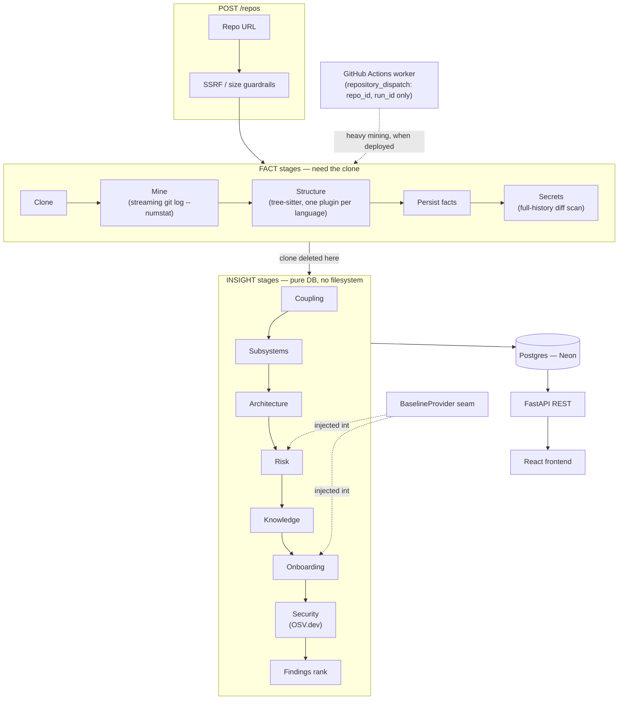

# Compass

**Compass mines a Git repository's full commit history and computes deterministic, reproducible intelligence about it — hidden change-coupling, calibrated risk, architecture, and security — the kind of signal that only exists in *how the code was written over time*, not in the current file tree an AI assistant reads.**

> *An AI chat tells you a plausible story about a repo. Compass computes the verifiable truth of it — who owns which file, what actually breaks when you touch something, which files secretly change together, and what was in the commits that got deleted — the same numbers every time.*


*That screenshot is real, unedited output — `requests`, one of the most widely used libraries in the Python ecosystem, has 223 pairs of files that reliably change together with no import connecting them, and 50 detected dependency cycles. Every ranked pair links to the actual shared commits.*

**[Live demo →](https://compass.example/repos/REPLACE_WITH_REAL_DEPLOYED_REPO_ID/onboard/passport)** — a pre-analysed, pinned repository. No waiting, no submission form. *(Placeholder — fill in once deployed; see [Deployment](#deployment) below. Four real showcase repositories are already analysed and pinned in the database — see [`SHOWCASE.md`](SHOWCASE.md).)*

---

## Why not just ask an AI?

This is the first question anyone asks, and it deserves a direct answer, not a defensive one.

**Concede what AI is good at first:** Cursor, Copilot, and Claude can read your current code, explain a function, and suggest a refactor. Compass does not compete on that — narrating what code does from the code itself is a solved problem.

**What an AI reading the current tree structurally cannot do:**

1. **It's blind to history.** The most valuable signal — which files secretly depend on each other, where bugs cluster, what secrets were committed and then deleted — lives only in the commit history and is erased from the final tree. An LLM reading today's snapshot has no way to reconstruct any of it.
2. **It's non-deterministic.** Ask it to rate a file's risk twice, get two different answers. A risk score has to be the same number every time to be defensible. Compass's analysis layer is pure functions over mined facts — deterministic by construction, not by discipline.
3. **It has no reference corpus.** An LLM can't tell you "your coupling is in the 90th percentile of Python projects this size" — it has no calibrated population to compare against. Compass builds and ships one (~30 curated repositories, percentile breakpoints, [`corpus_repos.yaml`](backend/app/baseline/corpus_repos.yaml)).
4. **Its context is bounded.** A real codebase doesn't fit in a context window, and retrieval over it is lossy. Compass computes over the *whole* graph — every file, every commit — with exact algorithms, not pattern-matching over a fragment.

**A concrete worked example, not a hypothetical:** the screenshot above. Ask an AI assistant to review `requests` and it will read `sessions.py`, `models.py`, `adapters.py` and describe each one competently. It has no way to tell you that `connectionpool.py` and `six.py` have changed together in 5 of the same commits with zero import between them — that fact isn't *in* any file; it only exists in the relationship between commits over time. Compass mines it in seconds and ranks it above 222 other pairs like it.

A second one: Compass's secret scanner diffs the *entire* commit history, not the current tree — a credential someone committed and then deleted in a later commit is gone from what an AI would read, but it's still fully recoverable from git history, and Compass finds it and tells you exactly which commit to rotate the key over.

> *The deeper point: Compass isn't "AI that reads code." It's a measurement instrument. You'd never ask a chatbot to be your thermometer.*

---

## What it actually does

Two modes over one shared engine layer — the same mined facts, aimed at two different moments.

### Onboard — get a stranger productive in hours, not weeks

| Feature | What it answers |
|---|---|
| **Guided reading order** | Where do I even start reading this codebase? |
| **Subsystem map** | What are the real architectural boundaries here (Louvain clustering over the coupling + dependency graph, not folder names)? |
| **Who-do-I-ask / expertise** | Who actually understands this file (Degree-of-Authorship, cited literature formula)? |
| **Truck factor** | How many people leaving would leave this codebase orphaned? |
| **Domain glossary** | What does this project's own vocabulary mean, mined from real identifiers? |
| **Blast radius** | If I change this file, what breaks — both what imports it *and* what historically changes with it but doesn't import it? |
| **The 3D code city** | A literal Wettel & Lanza CodeCity — buildings are files, height is complexity, colour is risk/owner/age. |
| **Evolution scrubber** | Watch the repository's shape, hotspots, and contributor mix change over 24 points in its history. |
| **Repo passport** | A one-page computed summary: identity, cadence, team shape, health, and a heuristic onboarding-difficulty score. |

### Audit — measure and harden the repo you already own

| Feature | What it answers |
|---|---|
| **Hidden dependencies** | Which files secretly change together with no import connecting them (the flagship — see above)? |
| **Architecture** | Dependency cycles, layering violations, unreferenced files — honestly caveated, never presented as confirmed dead code. |
| **Calibrated risk** | Which files are landmines — `0.60·norm(churn·complexity) + 0.25·norm(max coupling) + 0.15·norm(commit_count)` — with an *independent* confidence score, never folded into the number itself. |
| **Secrets in history** | Credentials committed and later deleted — still fully recoverable from git history, which is exactly why they still need rotating. |
| **Dependency vulnerabilities** | Declared dependencies (`requirements.txt`/`pyproject.toml`/`package-lock.json`/`pom.xml`) checked against OSV.dev. |
| **Commit hygiene** | Oversized commits, fixup-churn clusters, and a heuristic risky-commit detector — evidence-based, deliberately excludes folklore like "late-night commits are risky." |
| **Test maintenance gaps** | Files whose mapped tests haven't changed alongside them in a long time — maintenance signal, never a coverage claim. |
| **Benchmark** | This repo's metrics as percentiles against the curated corpus, with the exact repository list linked. |
| **A single ranked findings stream** | Every finding across every category above, ranked, confidence-scored, evidence-linked — never a wall of warnings. |

Every finding in both modes is ranked, confidence-scored, and links to the specific commits that produced it. That's a structural discipline (one `findings` table, one ranking pass), not a style choice — it's the direct answer to the alert fatigue that kills every other tool in this space.

---

## Architecture



**The Facts/Insight split is the load-bearing architectural decision.** Facts (commits, files, dependencies, raw secret hits) require the clone and are keyed by `repo_id` — replaced wholesale only when the remote `head_sha` actually changes, which is what makes re-analysing an unchanged repository nearly instant. Insight (coupling, risk, findings, health, ...) requires only the database and is keyed by `analysis_run_id` — a re-analysis creates a *new* run rather than overwriting the old one, which is what makes run-vs-run compare, time-travel, and LRU storage eviction all fall out of the same design instead of needing separate machinery.

**Every insight stage is a pure function over already-mined facts** — no git, no network, no filesystem, with exactly one documented exception (the security stage's OSV.dev lookup, which is `optional=True` so a third-party outage fails only that one stage, never the whole run). That purity is the literal code-level embodiment of "why not AI": determinism by construction, not by convention.

**The GitHub Actions worker is the whole point of the deploy shape.** Heavy mining is dispatched via `repository_dispatch` carrying only `repo_id`/`run_id` — no clone URL, no token, no credential of any kind — so the free web tier stays featherweight and survives cold starts, and a GitHub Actions outage falls back to running inline rather than taking Compass down.

---

## Explainability

Every number Compass shows is traceable to its own derivation, in the
product itself, not just in this document. Three small, public, read-only
API endpoints back that:

- **`GET /meta/formulas`** — every formula's real weights and thresholds,
  read live from the engine source (never re-typed), each tagged `locked`,
  `heuristic`, or `cited`.
- **`GET /meta/pipeline`** — the real thirteen-stage pipeline, in real
  execution order, read directly from the code that drives it.
- **`GET /meta/worked-example`** — one real, pinned showcase repository's
  actual per-stage output, so every claim on the pipeline walkthrough is
  independently checkable against a live analysis.

**[`/how-it-works`](https://compass.example/how-it-works)** is a
stage-by-stage walkthrough of the real pipeline built on the first two;
**[`/methods`](https://compass.example/methods)** is the formulas,
calibration, and limitations page built on the third — including the
limitations that look bad, since a limitations list with nothing
inconvenient in it isn't one. *(Replace with the real deployed URLs once
hosted — same placeholder convention as the live-demo link above.)*

---

## The locked formulas

Two numbers in this codebase are locked — never re-weighted, never varied per module, changed in exactly zero of the sixteen build sessions:

```
coupling_degree(A, B) = shared_revs(A, B) / min(revs(A), revs(B))
```

Dividing by the **less**-active file (never max, average, or one side alone) is what surfaces the case that actually matters: a rarely-touched file that is nonetheless *almost always* changed alongside a much busier one. That asymmetry is the entire signal — dividing by the busier file's count would crush the ratio and hide exactly the pattern this formula exists to catch.

```
risk_score = 0.60 · norm(churn_weighted · complexity)
           + 0.25 · norm(max coupling_degree across that file's pairs)
           + 0.15 · norm(commit_count)

risk_confidence = min(1.0, commit_count / 10)   # independent of risk_score
```

`risk_confidence` is never multiplied into or visually merged with `risk_score` — a file can be high-risk *and* low-confidence at once, and the UI always shows both, never one number that quietly averages the two. `norm()` is never hardcoded; it comes from an injected `BaselineProvider`, which is what lets the corpus calibration below plug in with zero change to either formula.

Everything else this project computes (health score weights, onboarding-difficulty score, subsystem edge weights, hygiene scoring, entry-point confidences) is explicitly labelled **heuristic** — a named, documented, tunable constant, never presented with the same certainty as the two formulas above.

---

## Calibration — what the corpus honestly is

Risk and health scores are normalized against a **percentile corpus**: ~30 hand-curated, real repositories ([`corpus_repos.yaml`](backend/app/baseline/corpus_repos.yaml), checked into the repository so every percentile is traceable to a named list, not a black box), run through the identical analysis pipeline every submitted repository goes through, reduced to plain percentile breakpoints (p10/p25/p50/p75/p90) per `(metric, language, size_bucket)` cell.

**What this is not:** a trained classifier, a defect-prediction model, SZZ-derived labels, or transfer learning. None of those exist in this codebase. "Your complexity is in the 80th percentile of Python repositories this size" needs a distribution to compare against, not a model — and a distribution is exactly, and only, what's built here. A cell backed by fewer than 5 contributing repositories widens the comparison (broader language, then broader size bucket) or falls back to an uncalibrated per-repo heuristic, rather than presenting a three-repository answer with the confidence of thirty.

`COMPASS_BASELINE_PROVIDER` defaults to `corpus` — the human running this project compared risk rankings under both the heuristic and corpus providers by hand and judged the corpus genuinely better calibrated, so it's the deployed default, not just an available option.

---

## Local setup

Requires a Postgres database (a free [Neon](https://neon.tech) project works well) and, for the backend test suite, Docker running locally.

```bash
cd backend
python -m venv .venv
.venv/Scripts/activate            # Windows; source .venv/bin/activate on Unix
pip install -e ".[dev]"
cp .env.example .env              # fill in DATABASE_URL
alembic upgrade head
uvicorn app.main:app --reload     # http://localhost:8000
```

```bash
cd frontend
npm install
cp .env.example .env              # VITE_API_URL, defaults to http://localhost:8000
npm run dev                       # http://localhost:5173
```

Submit a `github.com`/`gitlab.com` repository URL on the home page — the page navigates immediately and polls the ingestion job, so you see stage pills fill in progressively rather than staring at a spinner until the whole pipeline finishes.

```bash
cd backend && pytest -q -rs                                    # full backend suite
cd frontend && npm run typecheck && npm run lint && npx vitest run
```

See [`backend/CLAUDE.md`](backend/CLAUDE.md) for the full command reference (linting, one-file test invocation, how the ephemeral test database works) and [`CONTRIBUTING.md`](CONTRIBUTING.md) for the contribution workflow.

## Self-hosting a showcase

```bash
cd backend
python -m app.scripts.showcase add https://github.com/owner/name --rank 1
python -m app.scripts.showcase list
python -m app.scripts.showcase remove https://github.com/owner/name
```

`add` runs the full real pipeline, then pins the repository (publicly readable regardless of authentication, exempt from storage eviction) and pre-generates every narrative surface if LLM keys are configured — see [`SHOWCASE.md`](SHOWCASE.md) for the four repositories already pinned and, importantly, exactly how each one's secret-scan output was reviewed by hand before pinning.

## Deployment

Render (API, free tier) + Vercel (frontend) + Neon (Postgres) + a GitHub Actions worker for heavy mining — the complete, step-by-step guide with every environment variable is [`DEPLOY.md`](DEPLOY.md). The short version: it costs nothing to run, and it's built to survive Render's free-tier cold starts (a keep-alive ping) and stay under Neon's 0.5 GB cap indefinitely (LRU storage eviction, `backend/app/jobs/eviction.py` — never touches a showcase repository or a repo's current run).

---

## Honest limitations

A limitations section is a credibility signal, not a weakness — every one of these is a real, known trade-off, not something to discover the hard way.

- **Change coupling is genuinely weak on a single, sparse-history repository.** Module-level coupling (coarser directory/subsystem granularity, same locked formula) substantially mitigates this, and portfolio pooling helps further, but a 3-commit repo is still honestly low-confidence at any granularity.
- **Java same-package references aren't captured.** Java code frequently references another class in the same package with no explicit `import` — the Java analyzer only resolves explicit imports, the same "a missed edge is fine, a fabricated one isn't" conservatism as every other language analyzer.
- **JS/TS dynamic imports need a literal string argument.** `import(`./${name}`)` or `import(someVariable)` compute their target at runtime and are invisible to the structural graph — a real gap for route-based code-splitting, deliberately not guessed at.
- **Dependency scanning covers exactly four manifest formats**: `requirements.txt`, `pyproject.toml`'s `[project.dependencies]`, `package-lock.json`, and `pom.xml`'s top-level dependencies. Anything else gets an honest "no supported manifest found," never a partial or guessed scan.
- **File renames aren't tracked as continuity.** A rename is old-path-deleted + new-path-added on the next re-analysis, which can understate a file's true churn/coupling history across the rename — a documented simplification, not a bug to report.
- **The secret-detection rule set is a deliberately trimmed ~25-rule port of gitleaks**, not its full 150+ rule set, and the full-history scan is budget-guarded (2 GB / 60 seconds) — a repository large enough to hit either cap gets an honest "scanned the most recent N commits," never a silent partial result presented as complete.
- **Subsystem discovery is a computed partition, not verified ground truth.** Louvain clustering over the coupling + dependency graph is deterministic and reproducible, but it's a heuristic community detection, not a confirmed architectural boundary a human signed off on.
- **Free-tier hosting has real UX cost.** Render's free tier cold-starts after 15 minutes idle (mitigated by a keep-alive ping, not eliminated) and Neon's 0.5 GB cap is real (mitigated by LRU eviction, not infinite).
- **This is not a SAST/DAST replacement.** Secrets-in-history and basic dependency scanning are real and useful; Compass doesn't claim to be a full security product.

## Tech stack

| Piece | Choice | Why |
|---|---|---|
| Backend | Python 3.11 + FastAPI | The whole value layer (git mining, graph algorithms, calibration) is Python-native |
| Git mining | Streaming `git log --numstat` | One subprocess, fixed-size chunks — never buffers a large repo's full history into memory |
| Multi-language parsing | tree-sitter | One framework, one grammar per language, behind a single `LanguageAnalyzer` plugin seam |
| Complexity | lizard | Multi-language cyclomatic complexity with no compilation step |
| Graphs | NetworkX | Dependency graph, coupling network, blast-radius traversal, cycle/layer detection, Louvain clustering |
| Secrets | A trimmed gitleaks-pattern port over full-history diffs | Catches secrets in *deleted* history, not just the current tree |
| Vulnerabilities | OSV.dev | Free, keyless batch API — no key management burden for a self-hosted product |
| DB | Postgres via Neon + SQLAlchemy + Alembic | Free, persistent, and clean forward/backward migrations |
| Jobs | FastAPI `BackgroundTasks` locally → GitHub Actions worker when deployed | Same transport-agnostic `run_ingestion_job` function either way — no duplicated pipeline logic |
| Auth | GitHub OAuth | Private-repo analysis, portfolio view, identity-scoped rate limiting |
| Frontend | React + TypeScript + Vite | The rich-visualization requirement (graphs, 3D, charts) forces a real SPA |
| Visualization | react-force-graph-2d (graphs) · react-three-fiber (3D code city) · Recharts (charts) | Heavy rendering runs client-side — free compute, capped node counts so it never freezes a large repo's tab |
| Deploy | Render + Vercel + Neon, no paid services | Free-tier-survivable; showcase mode gives an instant public demo with zero live mining |

---

See [`ARCHITECTURE.md`](ARCHITECTURE.md) for a deeper technical walkthrough (the full stage-by-stage pipeline, the engine contract, the Facts/Insight schema), [`CONTRIBUTING.md`](CONTRIBUTING.md) for how to work on this codebase, and [`master-context.md`](master-context.md) *(gitignored, local-only)* for the complete design rationale this README summarizes.
